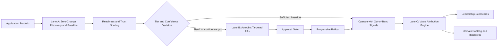
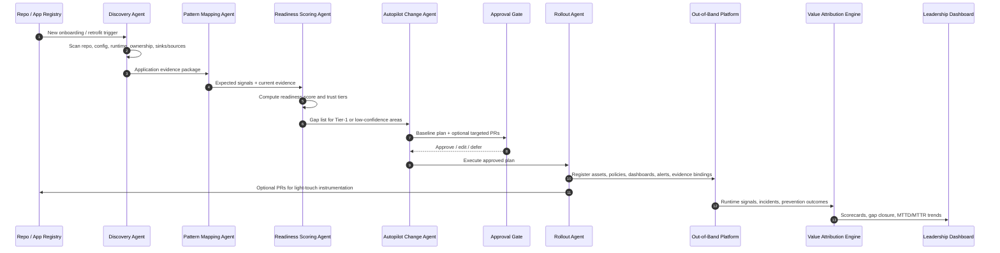
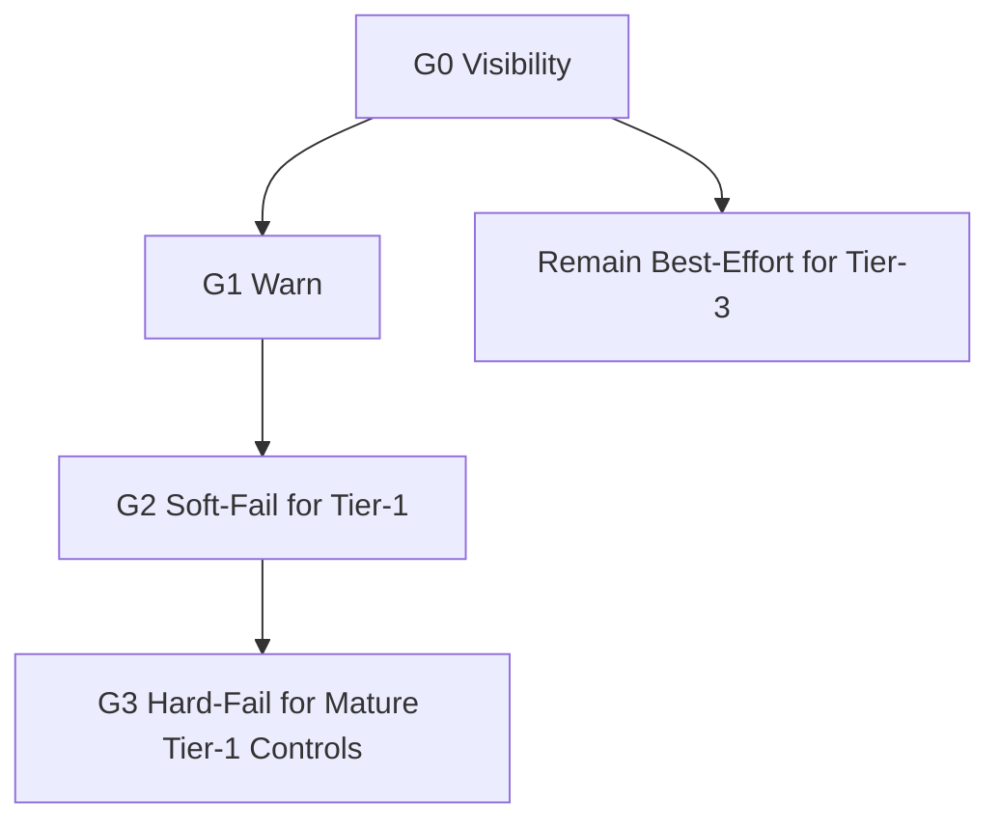
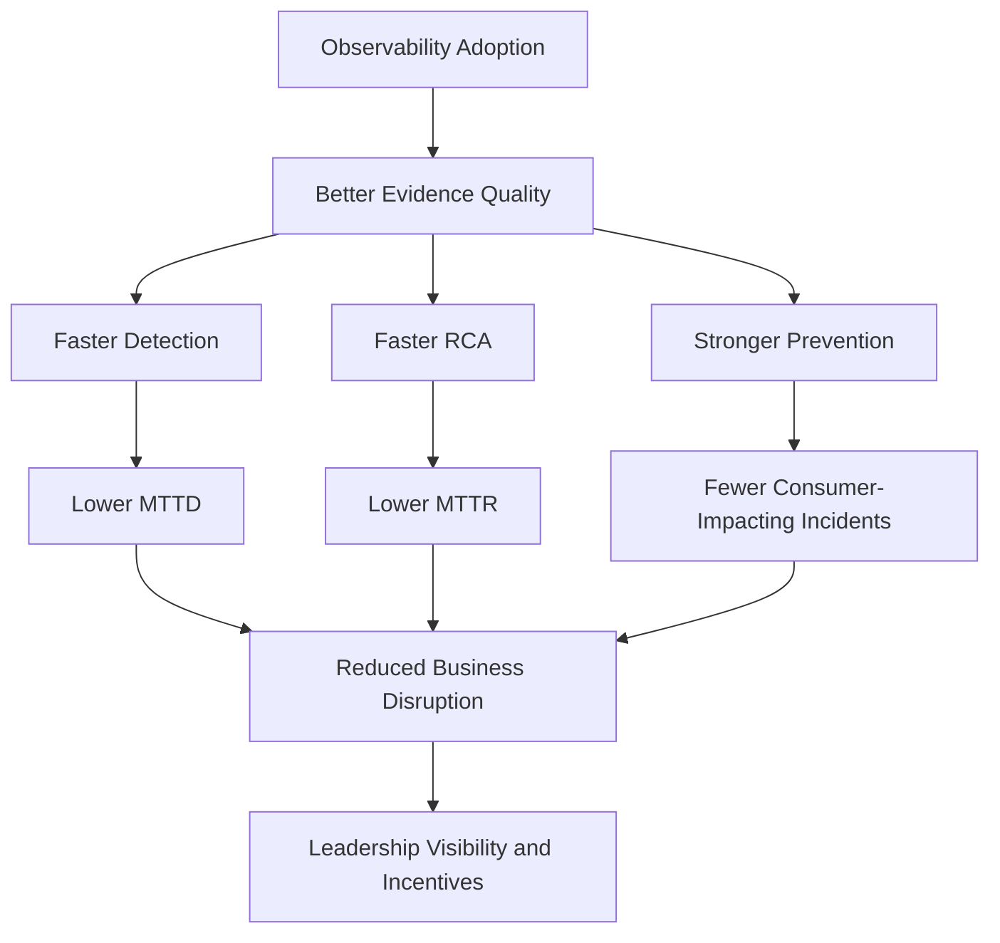
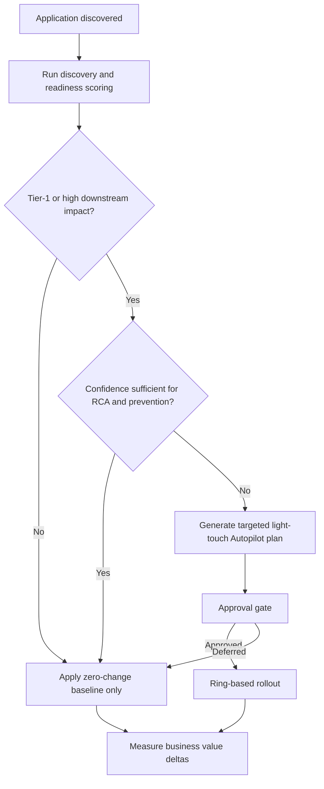

# Agentic Flow for Auto-Instrumenting Applications with Observability
## Review-Ready Architecture Decision Version

---

## 1. Executive Decision Summary

### Decision to approve
Adopt a **hybrid, two-lane agentic onboarding model with a mandatory business-value attribution layer**.

### Decision statement
Use **zero-change, out-of-band onboarding as the default baseline for all applications**, and use **selective Autopilot-generated light-touch instrumentation only for Tier-1 assets and confidence gaps**. Make **business-value attribution** a first-class part of the design so leadership can directly see how observability adoption reduces data issues, improves prevention, and lowers **MTTD / MTTR**.

### Why this is the recommended option
This option best balances:
- **fast onboarding** for producer teams,
- **high observability coverage** across services and batch,
- **minimal producer friction**,
- **safe rollout with approval gates**,
- and **measurable business outcomes** rather than shallow tool adoption.

### What leadership should expect
If implemented well, this model should create a visible flywheel:
1. more applications onboard quickly,
2. high-value gaps are targeted precisely,
3. incidents are detected earlier and resolved faster,
4. more issues are prevented before consumer impact,
5. leadership sees quantified value,
6. teams are incentivized to close the remaining observability gap.

---

## 2. Review Scope and Context

This design is intended for:
- **producer engineering teams**,
- platform and architecture review stakeholders,
- domain engineering leadership,
- reliability and governance stakeholders.

### In scope
- onboarding of **new services and batch applications**,
- retrofit of **existing applications**,
- zero-change baseline instrumentation,
- selective light-touch instrumentation for **Tier-1 datasets/services**,
- approval-gated rollout,
- leadership scorecards tied to business and operational outcomes.

### Out of scope
- universal mandatory SDK adoption on day one,
- blocking production traffic by default,
- measuring success by installation count, PR count, or dashboard count alone.

---

## 3. Architecture Decision Record

### Problem
The organization needs an onboarding and retrofit model that can instrument a large application estate quickly while still achieving high observability coverage where it matters most. The solution must start with **zero producer changes** where possible, support **services and batch applications**, preserve current out-of-band architectural direction, and create **leadership-visible business value** tied to reduced issues, better prevention, and improved MTTD/MTTR.

### Constraints
- many producers and platforms are hard to change immediately,
- rollout must avoid adding critical-path latency by default,
- producer friction must stay low,
- Tier-1 assets need stronger RCA and prevention than best-effort inference alone can provide,
- adoption must be justified through measurable business outcomes.

### Architectural principle
**Default to broad, low-friction onboarding first; escalate to targeted instrumentation only where confidence or business criticality justifies it.**

---

## 4. Options Considered

### Option A — Pure zero-change out-of-band model
Use only out-of-band discovery and signal generation. No producer-side improvements are requested.

### Option B — Push-first instrumentation model
Require source-side instrumentation or SDK adoption for most applications during onboarding.

### Option C — Hybrid two-lane model without value attribution
Use zero-change baseline plus selective light-touch instrumentation, but treat value measurement as secondary.

### Option D — **Recommended** hybrid two-lane model with business-value attribution
Use zero-change baseline for all, selectively push targeted changes for Tier-1 and confidence gaps, and attach a mandatory scorecard layer tying adoption to operational and business outcomes.

---

## 5. Formal Decision Matrix

### 5.1 Evaluation criteria and weights

| Criterion | Weight | Why it matters |
|---|---:|---|
| Onboarding speed | 20 | Broad estate coverage depends on low-friction rollout |
| Observability coverage potential | 20 | The model must eventually support strong RCA, freshness, lineage, and prevention |
| Producer friction | 15 | High friction slows adoption and creates resistance |
| Safety / blast-radius control | 10 | Observability rollout must not destabilize production paths |
| Fit to current architecture | 10 | Must align with current out-of-band / pre-consumption direction |
| Tier-1 effectiveness | 10 | Critical assets need stronger than best-effort signals |
| Operational scalability | 5 | The model must scale across many teams and applications |
| Governance / approval friendliness | 5 | Reviewable, auditable change flow is required |
| Business-value visibility | 5 | Leadership must be able to see the payoff clearly |
|
| **Total** | **100** |  |

### 5.2 Scoring scale
- **5** = excellent fit
- **4** = strong fit
- **3** = acceptable fit
- **2** = weak fit
- **1** = poor fit

### 5.3 Weighted comparison

| Option | Onboarding speed 20 | Coverage potential 20 | Producer friction 15 | Safety 10 | Current fit 10 | Tier-1 effectiveness 10 | Scalability 5 | Governance 5 | Value visibility 5 | Weighted total / 500 |
|---|---:|---:|---:|---:|---:|---:|---:|---:|---:|---:|
| A. Pure out-of-band | 5 | 3 | 5 | 5 | 5 | 2 | 5 | 4 | 2 | **405** |
| B. Push-first | 2 | 5 | 1 | 3 | 2 | 5 | 2 | 3 | 3 | **285** |
| C. Hybrid without value layer | 4 | 4 | 4 | 4 | 4 | 4 | 4 | 4 | 2 | **390** |
| D. Hybrid with value layer | 4 | 5 | 4 | 4 | 5 | 5 | 4 | 5 | 5 | **445** |

### 5.4 Decision outcome
**Option D is recommended** because it achieves the best overall balance and materially outperforms the alternatives on the dimensions that matter most for this program.

---

## 6. Rationale for Recommendation

### Why not Option A only
Pure out-of-band is the fastest to start and safest to deploy broadly, but it cannot consistently produce high-confidence business-semantic attribution, trace continuity, freshness truth, or strong prevention for Tier-1 assets. It is a strong baseline, but not a complete answer.

### Why not Option B only
A push-first model can produce excellent signal quality, but it introduces too much onboarding friction, requires broad producer change management, and is unlikely to scale quickly across a large existing estate.

### Why not Option C as-is
Option C is operationally strong, but it leaves out the most important organizational lever: **proving value to leadership**. Without that, the program risks being treated as platform overhead rather than a measurable incident-reduction and prevention program.

### Why Option D wins
Option D combines:
- the **speed and safety** of out-of-band onboarding,
- the **precision and trust improvement** of selective light-touch instrumentation,
- and the **organizational flywheel** created by leadership-visible business outcomes.

This is the only option that directly supports both **fast enterprise rollout** and **sustained adoption pressure through measurable value**.

---

## 7. Recommended Operating Model

### Operating principle
- **Lane A** provides fast baseline coverage.
- **Lane B** closes only the highest-value signal gaps.
- **Lane C** proves impact and drives organizational adoption.

---

## 8. End-State Design Principles

1. **Default to zero-change onboarding** unless strong evidence says targeted source changes are needed.
2. **Never confuse inferred signals with producer-attested truth.**
3. **Use trust tiers** to make signal confidence explicit.
4. **Target Tier-1 and high-blast-radius assets first** for light-touch improvements.
5. **Keep humans in approval gates** for tiering, ownership, and high-impact change proposals.
6. **Measure business pain removed**, not just instrumentation installed.
7. **Use progressive enforcement** rather than hard mandates on day one.

---

## 9. End-to-End Agentic Flow

### 9.1 Trigger conditions
The flow starts when any of the following occurs:
- new application onboarding request,
- repo or service registration event,
- retrofit initiative,
- incident revealing an observability blind spot,
- leadership-driven Tier-1 coverage program.

### 9.2 Core agents

| Agent | Purpose | Key outputs |
|---|---|---|
| Discovery Agent | scans repo, config, runtime, ownership, sinks/sources | application evidence package |
| Pattern Mapping Agent | maps app to enterprise reference pattern | baseline signal template |
| Evidence Planning Agent | separates inferred vs attested evidence | trust-tier signal plan |
| Readiness Scoring Agent | quantifies current observability posture | readiness score, gap list |
| Autopilot Change Agent | generates targeted config or PRs | minimal high-value improvements |
| Approval Agent | presents reviewable change package | approve, defer, edit |
| Rollout Agent | executes safe staged enablement | ring-based rollout |
| Value Attribution Agent | proves business and operational impact | scorecards, deltas, incentives |

### 9.3 Sequence view

---

## 10. Signal Trust Model

| Trust tier | Meaning | Examples |
|---|---|---|
| Inferred | best-effort conclusion from indirect evidence | repo scan, config inference, catalog hints |
| Platform-attested | strong signal from authoritative platform/runtime evidence | deploy events, Delta history, scheduler metadata, Kafka principal, traces |
| Producer-attested | explicit source-declared or emitted evidence | contract file, event_time, producer identity field, business checkpoint |

### Review rule
For Tier-1 decisions, **high-impact prevention and RCA should prefer platform-attested or producer-attested signals**.

---

## 11. Lane A — Zero-Change Baseline

### Purpose
Establish broad observability coverage without requiring producer changes.

### What it does
- discovers assets and ownership,
- attaches out-of-band signal generation,
- creates baseline dashboards and alerts,
- computes readiness and trust scores,
- identifies confidence gaps without blocking production.

### What it can do well
- asset inventory,
- basic freshness and volume,
- schema drift detection from observed payloads,
- initial lineage seeds,
- deploy-to-incident correlation where data exists.

### What it cannot do reliably everywhere
- exact producer identity,
- strong business-semantic lineage,
- perfect async trace continuity,
- freshness truth when timestamps are absent,
- contract truth where no contract is declared.

---

## 12. Lane B — Selective Light-Touch Autopilot

### Activation criteria
- Tier-1 asset,
- high downstream blast radius,
- repeated incident hotspot,
- low signal confidence blocking strong RCA or prevention.

### Typical targeted changes

| Requirement area | Typical change | Why it matters |
|---|---|---|
| Tracing | add propagation or key spans | improves causal RCA |
| Attribution | add producer identity field/header | improves source ownership certainty |
| Freshness | add event_time / processing_time | improves freshness truth |
| Contracts | add contract definition file | enables safer prevention and conformance |
| DQ | add starter checks or publish markers | improves pre-consumption protection |
| Metadata | add dataset URN / semantic ID | strengthens lineage and blast radius |

### Design rule
**Push only the minimum changes required to raise a high-value signal from weak trust to acceptable trust.**

---

## 13. Approval and Rollout Model

### Approval gates
| Gate | Review focus |
|---|---|
| Gate 1 | baseline inferred inventory, ownership, tier, policy skeleton |
| Gate 2 | targeted Autopilot-generated changes |
| Gate 3 | progressive enforcement posture for mature Tier-1 controls |

### Progressive enforcement

| Stage | Meaning | Typical scope |
|---|---|---|
| G0 | visibility only | all apps start here |
| G1 | warn | missing contracts, weak trace anchors |
| G2 | soft-fail in lower env / alert in prod | Tier-1 with better confidence |
| G3 | hard-fail for critical mature controls | selected Tier-1 controls only |

---

## 14. Business-Value Attribution Layer

This is the required differentiator.

### Core principle
**Do not measure observability adoption by instrumentation installed. Measure it by observability gap closed and business pain removed.**

### Value chain

### Scorecard dimensions

| Dimension | Example metrics |
|---|---|
| Coverage | readiness score, signal completeness, trust-tier mix |
| Operations | MTTD delta, MTTR delta, false positive reduction |
| Prevention | prevented schema issues, prevented stale-data exposures |
| RCA quality | % incidents with deterministic or high-confidence causal explanation |
| Adoption | time to baseline, PR merge SLA, rollback rate |
| Business impact | hours saved, Sev cost avoided, critical dashboards protected |

### Incentive model
Reward teams for:
- closing Tier-1 gaps,
- reducing MTTD / MTTR,
- preventing consumer-impacting incidents,
- sustaining healthy scorecards over time.

Do not reward teams for:
- PR count,
- SDK presence alone,
- raw dashboard count.

---

## 15. Example Decision Logic

---

## 16. Example Review Scenarios

### Scenario A — Spark batch pipeline writing a Tier-1 Delta table
Recommended outcome:
- baseline onboarding through Lane A,
- targeted addition of event_time, publish marker, contract file, and dataset URN if needed,
- measure reduction in stale-data detection time and downstream blast radius.

### Scenario B — Kafka-producing service feeding many downstream consumers
Recommended outcome:
- baseline out-of-band contract-lite and topology coverage,
- targeted trace propagation, producer identity, and contract definition if confidence is low,
- measure prevention of bad payload spread and faster blast-radius identification.

---

## 17. Risks and Mitigations

| Risk | Why it matters | Mitigation |
|---|---|---|
| LLM over-infers semantics | false confidence can mislead RCA | expose trust tiers; require approval for low-confidence mappings |
| Too much push too early | slows adoption | keep zero-change as default; target only high-value gaps |
| PRs not merged | Tier-1 gaps remain open | leadership-backed merge SLA for critical assets |
| Scorecards become vanity metrics | teams optimize activity, not outcomes | tie metrics to prevention and incident deltas |
| Wrong tiering | wrong teams get burdened | explicit human review of tier assignments |
| Observability pipeline failure | can hide incidents | build observability-of-observability and surface evidence gaps |

---

## 18. Review Board Recommendation

### Approve with the following stance
1. **Approve Lane A** as the mandatory default onboarding path.
2. **Approve Lane B** as a selective, approval-gated augmentation path for Tier-1 and confidence gaps.
3. **Require Lane C** as part of the architecture, not as a later reporting enhancement.
4. **Require trust-tier scoring** so signal certainty is transparent.
5. **Use progressive enforcement** rather than immediate hard gating.

### Decision summary sentence
**Approve the hybrid model because it is the only option that simultaneously supports rapid enterprise onboarding, strong Tier-1 observability, low producer friction, and leadership-visible business value tied to issue reduction, prevention, and MTTD/MTTR improvement.**

---

## 19. Next-Step Artifacts Suggested

1. PRD for the agent set and control-plane workflow
2. readiness score schema and scoring rules
3. API contracts for onboarding, approval, and scorecard retrieval
4. sample leadership dashboard wireframes
5. framework-specific retrofit playbooks for services and Spark batch
6. implementation roadmap with pilot, scale-out, and governance milestones
